<!--

-->
<!--

-->

<!--
can use hide=glsl,js
-->
##  👋Who am i

- 一般路过
- 擅长 ctrl+c 和 ctrl+v
- 啥也不会别想了，没有擅长语言
- Learning how to program worse

<picture>
  <source media="(prefers-color-scheme: dark)" srcset="[github-snake-dark.svg](https://github.com/IJNKAWAKAZE/IJNKAWAKAZE/blob/output/github-contribution-grid-snake-dark.svg)">
  <source media="(prefers-color-scheme: light)" srcset="https://github.com/IJNKAWAKAZE/IJNKAWAKAZE/blob/output/github-contribution-grid-snake.svg">
  
</picture>

